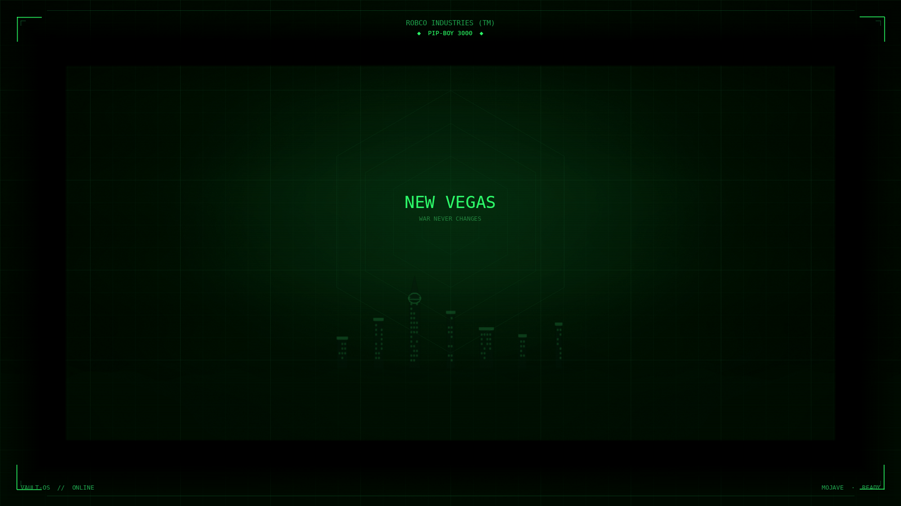
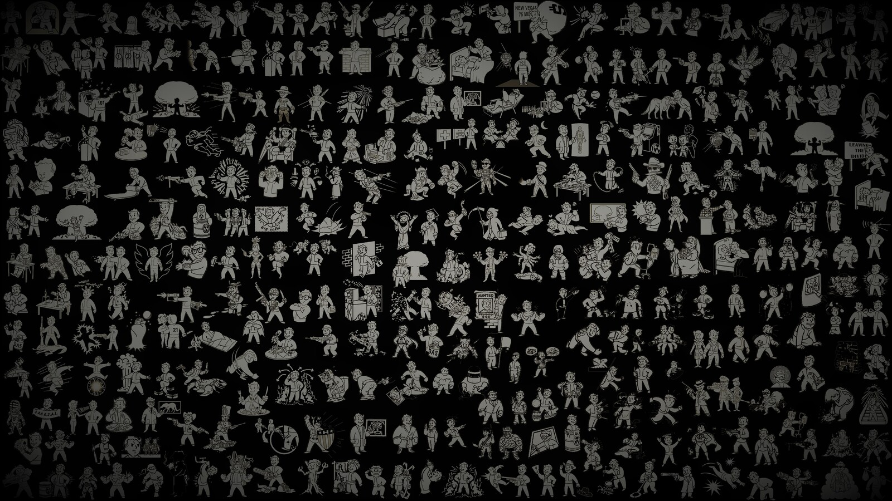

# Vault-OS

**Fallout: New Vegas Pip-Boy rice for Arch Linux + XFCE.**

A full desktop stack: phosphor GTK theme, CRT icon set, custom cursors, Mojave wallpapers, Qt/Kvantum, terminal, Firefox/Chromium/Discord/VS Code skins, and a `vault-os` control plane that keeps the look applied after login.


<p align="center">
  
  
</p>

Unofficial fan work. Not affiliated with Bethesda / ZeniMax.

## What you get

| Layer | Name |
| --- | --- |
| GTK 2/3/4 + xfwm4 + notifications | **PipBoy-NV** |
| Icons | **FalloutMojave** (CRT badges, inherits Papirus-Dark) |
| Cursors | **PipBoy-NV-Cursors** |
| Qt 5/6 | Kvantum **PipBoy-NV** via qt5ct |
| Terminal | ROBCO Termlink palette + Share Tech Mono |
| Shell | Pip-Boy 3000 bash prompt, boot banner, `pipboy-status` |
| Compositor | picom (green-tinted shadows, no blur mush) |
| Workspaces | STAT / DATA / ITEM / MAP |
| Apps | Firefox userChrome, Chromium theme, Discord CSS, VS Code theme |
| Login (optional) | LightDM greeter + GRUB background |

### Palette

| Token | Hex | Use |
| --- | --- | --- |
| Phosphor | `#33FF6A` | Primary UI / text |
| Bright | `#C8FFD8` | Hover, cursor, emphasis |
| Mid | `#249B4C` | Accents |
| Dim | `#1A4A2A` | Inactive / comments |
| Border | `#147832` | Hairlines |
| CRT BG | `#070C09` | Windows |
| Elevated | `#0D1510` | Headers, menus, panels |

## Requirements

- Arch Linux (or close derivative)
- XFCE 4 session
- Papirus-Dark (icon fallback)

```bash
sudo pacman -S --needed xfce4 xfce4-goodies papirus-icon-theme \
  kvantum qt5ct qt6ct picom ttf-sharetech-mono \
  xfce4-whiskermenu-plugin python-gobject libwnck3 rsync
```

`ttf-sharetech-mono` may be in the AUR. The installer also ships Share Tech Mono + VT323.

## Install

```bash
git clone https://github.com/IAmXMob69/vault-os.git
cd vault-os
./install.sh
```

Log out and back into XFCE (or run `vault-os apply` then `vault-os doctor`).

Optional system greeter / GRUB (needs sudo):

```bash
./install.sh --system
```

## Commands

```bash
vault-os status            # health check
vault-os apply             # apply GTK / icons / cursor / panels (not wallpaper)
vault-os doctor            # repair theme + panels
vault-os coverage          # what is themed
vault-os ensure-theme      # re-assert after login races
vault-os-lock              # lock screen
help-pipboy                # terminal help
pipboy-status              # STAT screen
pipboy-green / pipboy-amber
```

## Layout after install

```
~/.themes/PipBoy-NV
~/.local/share/icons/FalloutMojave
~/.icons/PipBoy-NV-Cursors
~/.local/share/backgrounds/fnv-*.jpg
~/.local/share/sounds/PipBoy-NV
~/.config/pipboy/
~/.config/Kvantum/PipBoy-NV
~/.local/bin/vault-os
```

## Repo map

```
bin/           vault-os control plane + helpers
config/        XFCE, GTK, Qt, picom, Firefox, Discord, VS Code, Chromium
themes/        PipBoy-NV (GTK + xfwm4 + notify)
icons/         FalloutMojave + dock icons
cursors/       PipBoy-NV-Cursors
wallpapers/    Mojave / CRT / Vault Boy
fonts/         Share Tech Mono, VT323 (OFL)
sounds/        Pip-Boy beep pack
extras/        panel art, LightDM template
docs/          theme notes and upgrade history
```

## Notes

- Extracted *Fallout: New Vegas* game textures and the official boot intro video are **not** in this repo.
- The installer is idempotent. Re-run it after `git pull`. It will not overwrite your wallpaper, panel layout, or `vault-os.conf`.
- Firefox: copy `config/firefox/user.js` + `chrome/userChrome.css` into your profile (or let the installer drop them on the default profile).
- Discord: enable `PipBoyNV.theme.css` in Vencord or BetterDiscord.
- Chromium: the installer installs an unpacked Pip-Boy theme; reopen Chromium after install.

## License

MIT for original theme code, configs, and generated assets. See [LICENSE](LICENSE).
Fonts remain under the SIL Open Font License.
Fallout is a trademark of Bethesda Softworks LLC.
